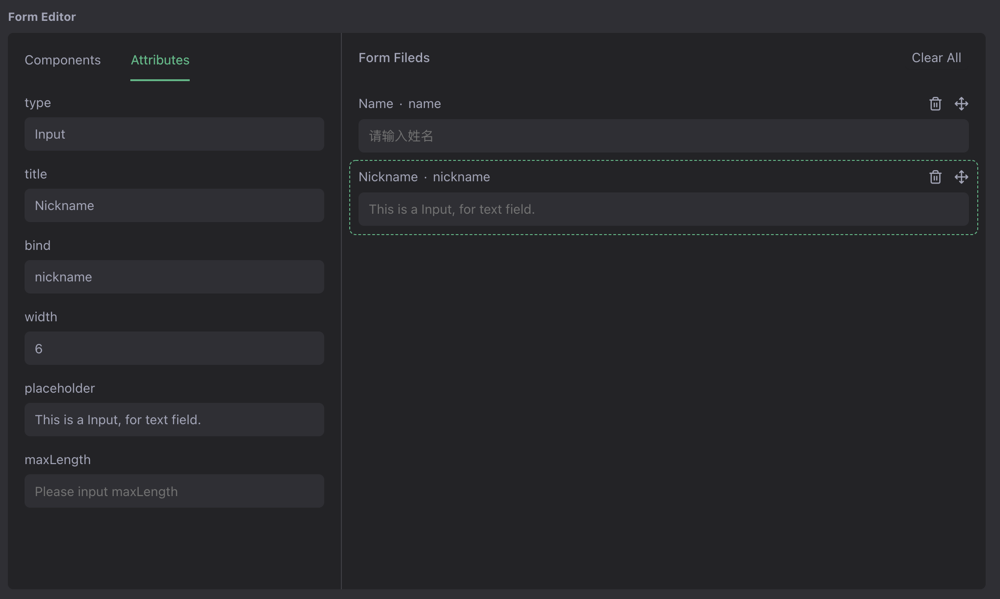

# YAO Widget DEMO



[English](README.md)

云表格 DEMO

参考文档: [https://yaoapps.com/doc](https://yaoapps.com/doc/%E6%95%99%E7%A8%8B/%E4%BD%BF%E7%94%A8%20YAO%20Widget%20%E8%87%AA%E5%BB%BA%E4%BA%91%E8%A1%A8%E6%A0%BC)

## 下载安装

### 使用 Docker 运行

```bash
docker run -d -p 5099:5099 --restart unless-stopped \
    -e YAO_INIT=demo \
    -e YAO_PROCESS_RESET=flows.init.menu \
    -e YAO_PROCESS_DEMO=flows.demo.data \
    yaoapp/demo-widget:1.0.3-amd64
```

### 在本地运行

#### 下载源码

```bash
git clone https://github.com/YaoApp/demo-widget /app/path/widget

```

#### 设置环境变量

```bash
mkdir /app/path/widget/db
mkdir /app/path/widget/data
mkdir /app/path/widget/logs

cat << EOF
YAO_ENV=development # development | production
YAO_ROOT="/app/path/widget"
YAO_HOST="0.0.0.0"
YAO_PORT="5099"
YAO_SESSION="memory"
YAO_LOG="/app/path/widget/logs/application.log"
YAO_LOG_MODE="TEXT"  #  TEXT | JSON
YAO_JWT_SECRET="bLp@bi!oqo-2U+hoTRUG"
YAO_DB_DRIVER=sqlite3 # sqlite3 | mysql
YAO_DB_PRIMARY="/app/path/asset/db/yao.db"
EOF > /app/path/widget/.env
```

#### 项目初始化

```bash
cd /app/path/widget

# 创建数据表 & 设置菜单
yao migrate --reset
yao run flows.setmenu


```

#### 启动服务

```bash
cd /app/path/widget
yao start
```

## 管理后台

打开浏览器输入以下网址进入:

http://127.0.0.1:5099/xiang/login/admin

用户名: `xiang@iqka.com`
密码: `A123456p+`
